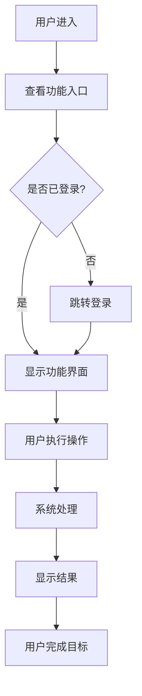

# 功能设计模板 (Feature Design Template)

**Feature**: [功能名称]

**Version**: 1.0
**Date**: [日期]
**Author**: [作者]
**Status**: 🔵 Draft / 🟡 In Review / 🟢 Approved / 🔴 Rejected

---

## 功能概述 (Feature Overview)

### 一句话描述

[用一句话描述这个功能的核心价值，不超过 30 字]

### 功能背景 (Background)

**问题陈述**:
- 当前存在什么问题？
- 用户遇到了什么痛点？
- 这个问题有多严重？影响了多少用户？

**机会空间**:
- 如果解决这个问题，会带来什么价值？
- 目标用户群体是谁？规模多大？
- 市场上的竞品如何处理这个问题？

**战略对齐**:
- 这个功能如何支持产品战略？
- 对应哪个 OKR/KPI？
- 优先级评分：P0 / P1 / P2 / P3

---

## 目标与成功指标 (Goals & Success Metrics)

### 业务目标

**主要目标**:
- [ ] [目标 1，如：提升用户留存率]
- [ ] [目标 2，如：增加功能使用率]
- [ ] [目标 3，如：降低支持成本]

**次要目标**:
- [ ] [次要目标 1]
- [ ] [次要目标 2]

### 成功指标 (Success Metrics)

| 指标 | 当前值 | 目标值 | 测量方式 | 责任人 |
|------|--------|--------|----------|--------|
| [指标名称，如：DAU] | XXX | XXX | [如何测量] | [姓名] |
| [指标 2] | XXX | XXX | [如何测量] | [姓名] |

**关键里程碑**:
- [ ] Milestone 1: [描述] - 截止日期：YYYY-MM-DD
- [ ] Milestone 2: [描述] - 截止日期：YYYY-MM-DD
- [ ] Milestone 3: [描述] - 截止日期：YYYY-MM-DD

---

## 目标用户 (Target Users)

### 用户画像

**主要用户群体**:
- **角色**: [如：企业开发者 / 个人创作者]
- **特征**: [技能水平、使用场景、目标]
- **占比**: XX% 的目标用户

**次要用户群体**:
- **角色**: [次要用户类型]
- **特征**: [描述]
- **占比**: XX%

### 用户需求分析

**用户说**:
> "我希望能够...[真实用户反馈]"

**我们理解的需求**:
- 显性需求：[用户明确表达的需求]
- 隐性需求：[用户没说但确实需要的]

**需求优先级**:
| 需求 | 重要性 | 紧急性 | 难度 | 优先级 |
|------|--------|--------|------|--------|
| [需求 1] | 🔴 高 | 🔴 高 | 🟢 低 | P0 |
| [需求 2] | 🟡 中 | 🟡 中 | 🟡 中 | P1 |

---

## 功能范围 (Scope)

### 核心功能 (Core Features)

#### Feature 1: [功能名称]

**描述**: [详细描述这个功能做什么]

**用户价值**: [用户能从中获得什么]

**功能细节**:
- **输入**: [用户需要提供什么]
- **处理**: [系统如何处理]
- **输出**: [用户得到什么结果]

**技术要求**:
- [ ] 性能：[如：响应时间 < 500ms]
- [ ] 可用性：[如：99.9% uptime]
- [ ] 可扩展性：[如：支持 10k 并发用户]

**依赖项**:
- 前置依赖：[需要先完成什么]
- 外部依赖：[依赖哪些第三方服务]

---

#### Feature 2: [功能名称]

[重复上述结构]

---

### 增强功能 (Nice-to-Have)

- [ ] [增强功能 1] - 优先级：P2
- [ ] [增强功能 2] - 优先级：P3

### 不包含的功能 (Out of Scope)

明确列出**不在此次实现范围内**的功能，避免范围蔓延：

- ❌ [功能 X]：原因 - [为什么不做]
- ❌ [功能 Y]：原因 - [推迟到下个版本]

---

## 功能流程 (Feature Flow)

### 主流程 (Happy Path)



**流程步骤详解**:

1. **步骤 1**: [步骤名称]
   - 用户操作：[用户做什么]
   - 系统响应：[系统如何反应]
   - 预期时长：X 秒
   - 错误处理：[如果失败怎么办]

2. **步骤 2**: [步骤名称]
   - [详细描述]

---

### 替代流程 (Alternative Flows)

#### 流程 A: [场景名称]

**触发条件**: [什么情况下会走这个流程]

**流程描述**:
1. [步骤 1]
2. [步骤 2]
3. [返回主流程 / 结束]

---

### 异常流程 (Exception Flows)

#### 异常 1: [错误类型]

**触发条件**: [什么会导致这个错误]

**错误表现**: [用户看到什么]

**恢复方式**:
- 自动恢复：[系统能自动修复吗]
- 用户操作：[用户需要做什么]
- 兜底方案：[最坏情况的处理]

---

## 技术设计 (Technical Design)

### 系统架构

```
┌─────────────┐
│  Frontend   │
│  (React)    │
└──────┬──────┘
       │ API Calls
┌──────▼──────┐
│  Backend    │
│  (Node.js)  │
└──────┬──────┘
       │ Queries
┌──────▼──────┐
│  Database   │
│ (PostgreSQL)│
└─────────────┘
```

### 数据模型 (Data Model)

#### Entity 1: [实体名称]

```typescript
interface EntityName {
  id: string;
  field1: string;
  field2: number;
  field3?: boolean; // Optional
  createdAt: Date;
  updatedAt: Date;
}
```

**字段说明**:
- `id`: 主键，UUID
- `field1`: [描述用途]
- `field2`: [描述用途]

**索引**:
- Primary: `id`
- Index: `field1`, `field2`

**关联关系**:
- Has Many: [关联实体]
- Belongs To: [关联实体]

---

### API 设计 (API Design)

#### API 1: [API 名称]

**Endpoint**: `POST /api/feature/action`

**描述**: [API 的作用]

**请求参数**:
```json
{
  "param1": "string",
  "param2": 123,
  "param3": {
    "nested": "value"
  }
}
```

**响应示例** (200 Success):
```json
{
  "success": true,
  "data": {
    "result": "value",
    "id": "xxx"
  },
  "message": "操作成功"
}
```

**错误响应** (400 Bad Request):
```json
{
  "success": false,
  "error": "Invalid parameter",
  "code": "INVALID_PARAM"
}
```

**性能要求**:
- 响应时间：< 500ms (P95)
- 并发量：1000 req/s
- 成功率：> 99.5%

---

### 技术栈选择

| 组件 | 技术选型 | 理由 |
|------|----------|------|
| Frontend | React 18 + TypeScript | 类型安全，组件化开发 |
| Backend | Node.js + Express | 高性能，生态丰富 |
| Database | PostgreSQL | 关系型数据，ACID 保证 |
| Cache | Redis | 高速缓存，降低 DB 压力 |

---

## 界面设计 (UI Design)

### 界面结构

```
┌─────────────────────────────────────┐
│           Header / Nav              │
├─────────────────────────────────────┤
│  ┌───────┐  ┌──────────────────┐   │
│  │       │  │                  │   │
│  │ Side  │  │   Main Content   │   │
│  │ bar   │  │                  │   │
│  │       │  │                  │   │
│  └───────┘  └──────────────────┘   │
└─────────────────────────────────────┘
```

### 关键界面 (Key Screens)

#### 界面 1: [界面名称]

**目的**: [用户在这个界面要完成什么]

**布局**: [描述布局结构]

**关键元素**:
- **元素 1**: [名称] - 作用：[做什么]
- **元素 2**: [名称] - 作用：[做什么]

**交互行为**:
- 点击 [元素] → [触发什么]
- 输入 [字段] → [验证规则]

**状态变化**:
- 加载中：[显示什么]
- 成功：[显示什么]
- 失败：[显示什么]

**响应式设计**:
- Desktop (> 1024px): [布局方式]
- Tablet (768-1024px): [布局方式]
- Mobile (< 768px): [布局方式]

---

## 安全与权限 (Security & Permissions)

### 权限控制

**角色定义**:
- **Admin**: 可以 [操作列表]
- **User**: 可以 [操作列表]
- **Guest**: 可以 [操作列表]

**功能权限矩阵**:

| 功能 | Admin | User | Guest |
|------|-------|------|-------|
| 查看功能 | ✅ | ✅ | ❌ |
| 创建内容 | ✅ | ✅ | ❌ |
| 编辑内容 | ✅ | 🟡 仅自己 | ❌ |
| 删除内容 | ✅ | ❌ | ❌ |

### 数据安全

**敏感数据处理**:
- [ ] 密码：bcrypt 加密，salt rounds = 10
- [ ] Token：JWT，有效期 24h，HttpOnly Cookie
- [ ] 用户数据：传输加密（TLS 1.3），存储加密

**安全防护**:
- [ ] XSS 防护：输入验证 + 输出转义
- [ ] CSRF 防护：CSRF Token
- [ ] SQL 注入防护：参数化查询
- [ ] Rate Limiting：每 IP 每分钟最多 100 请求

---

## 性能优化 (Performance Optimization)

### 性能目标

| 指标 | 目标值 | 测量方式 |
|------|--------|----------|
| 首屏加载时间 (FCP) | < 1.5s | Lighthouse |
| 可交互时间 (TTI) | < 3s | Lighthouse |
| 最大内容绘制 (LCP) | < 2.5s | Core Web Vitals |
| API 响应时间 (P95) | < 500ms | APM 监控 |
| 数据库查询时间 (P95) | < 100ms | Slow Query Log |

### 优化策略

**前端优化**:
- [ ] 代码分割：React.lazy + Suspense
- [ ] 资源压缩：Gzip / Brotli
- [ ] 图片优化：WebP 格式，懒加载
- [ ] 缓存策略：Service Worker，CDN

**后端优化**:
- [ ] 数据库索引：为高频查询字段建索引
- [ ] 缓存层：Redis 缓存热数据，TTL = 1h
- [ ] 批量操作：批量插入/更新，减少 DB 往返
- [ ] 异步处理：使用消息队列处理耗时任务

---

## 测试计划 (Testing Plan)

### 测试策略

#### 单元测试 (Unit Tests)

**目标覆盖率**: > 80%

**重点测试模块**:
- [ ] 核心业务逻辑函数
- [ ] 数据验证和转换
- [ ] 错误处理分支

**示例测试用例**:
```typescript
describe('Feature X', () => {
  it('should handle valid input', () => {
    const result = processInput(validData);
    expect(result).toBe(expectedOutput);
  });

  it('should throw error for invalid input', () => {
    expect(() => processInput(invalidData)).toThrow(ValidationError);
  });
});
```

---

#### 集成测试 (Integration Tests)

**测试场景**:
- [ ] API 端到端流程
- [ ] 数据库交互
- [ ] 第三方服务集成

---

#### 端到端测试 (E2E Tests)

**关键用户流程**:
- [ ] 用户注册 → 登录 → 使用功能 → 退出
- [ ] [其他关键流程]

**工具**: Playwright / Cypress

---

#### 性能测试 (Performance Tests)

**负载测试**:
- 并发用户：1000 / 5000 / 10000
- 目标：响应时间 < 1s，错误率 < 0.1%

**压力测试**:
- 持续时间：30 分钟
- 目标：找到系统瓶颈

---

### 测试环境

| 环境 | 用途 | 数据 | 访问方式 |
|------|------|------|----------|
| Dev | 开发测试 | Mock 数据 | localhost |
| Staging | 预生产验证 | 匿名化生产数据 | staging.domain.com |
| Production | 正式环境 | 真实数据 | www.domain.com |

---

## 部署计划 (Deployment Plan)

### 发布策略

**发布方式**: 🔵 蓝绿部署 / 🎯 灰度发布 / 🚀 全量发布

**灰度发布计划** (如适用):
- Phase 1 (Day 1-3): 5% 用户
- Phase 2 (Day 4-7): 20% 用户
- Phase 3 (Day 8-14): 50% 用户
- Phase 4 (Day 15+): 100% 全量

**回滚方案**:
- 触发条件：错误率 > 1% 或 P95 响应时间 > 2s
- 回滚步骤：[详细步骤]
- 回滚时长：< 5 分钟

---

### 监控与告警

**监控指标**:
- [ ] 应用性能：响应时间、吞吐量、错误率
- [ ] 基础设施：CPU、内存、磁盘、网络
- [ ] 业务指标：功能使用量、转化率

**告警规则**:
- 🔴 P0 (Critical): 错误率 > 5%，立即通知 On-call
- 🟡 P1 (High): 响应时间 > 2s，通知负责人
- 🟢 P2 (Medium): 功能使用量异常，发送日报

**工具**: Prometheus + Grafana / DataDog / New Relic

---

## 风险管理 (Risk Management)

### 风险识别

| 风险 | 可能性 | 影响 | 缓解措施 | 责任人 |
|------|--------|------|----------|--------|
| [技术风险] | 🟡 中 | 🔴 高 | [缓解方案] | [姓名] |
| [资源风险] | 🟢 低 | 🟡 中 | [缓解方案] | [姓名] |

### 应急预案

**场景 1: 功能上线后发现严重 Bug**
- 立即回滚到上一版本
- 修复 Bug 并在 Staging 环境验证
- 重新发布

**场景 2: 性能不达标**
- 启用备用缓存策略
- 限流保护核心功能
- 优化慢查询

---

## 文档与培训 (Documentation & Training)

### 用户文档

- [ ] 功能介绍文档
- [ ] 操作指南（含截图/视频）
- [ ] FAQ 常见问题
- [ ] 故障排查指南

### 开发文档

- [ ] API 文档（Swagger/OpenAPI）
- [ ] 数据库 Schema 文档
- [ ] 架构设计文档
- [ ] 代码注释和 README

### 培训计划

**内部培训**:
- 目标：开发、测试、产品团队
- 时间：上线前 1 周
- 内容：技术实现、测试要点、产品逻辑

**用户培训** (如需要):
- 目标：Beta 用户 / VIP 客户
- 时间：灰度发布期间
- 内容：新功能介绍、使用指南、Q&A

---

## 成本估算 (Cost Estimation)

### 开发成本

| 角色 | 人数 | 工时 (人天) | 费用 |
|------|------|-------------|------|
| 产品经理 | 1 | 5 | XXX |
| 前端工程师 | 2 | 20 | XXX |
| 后端工程师 | 2 | 25 | XXX |
| 测试工程师 | 1 | 10 | XXX |
| 设计师 | 1 | 5 | XXX |
| **总计** | 7 | 65 | **XXX** |

### 运营成本

| 项目 | 月度费用 | 年度费用 | 备注 |
|------|----------|----------|------|
| 服务器 | $XXX | $XXX | AWS/阿里云 |
| 数据库 | $XXX | $XXX | RDS |
| CDN | $XXX | $XXX | Cloudflare |
| 监控 | $XXX | $XXX | DataDog |
| **总计** | **$XXX** | **$XXX** | |

---

## 时间规划 (Timeline)

### 里程碑

```
Week 1-2: 需求澄清 & 设计评审
   ├── Day 1-3: 用户研究和需求分析
   ├── Day 4-7: 技术方案设计
   └── Day 8-10: 设计评审和确认

Week 3-5: 开发实现
   ├── Week 3: 前端页面开发
   ├── Week 4: 后端 API 开发
   └── Week 5: 前后端联调

Week 6: 测试与优化
   ├── Day 1-3: 功能测试
   ├── Day 4-5: 性能测试和优化
   └── Day 6-7: Bug 修复

Week 7: 部署与发布
   ├── Day 1-2: Staging 环境验证
   ├── Day 3-5: 灰度发布
   └── Day 6-7: 全量发布和监控
```

### 关键节点

- **2024-XX-XX**: 设计评审完成
- **2024-XX-XX**: 开发完成，提交测试
- **2024-XX-XX**: 测试通过，准备发布
- **2024-XX-XX**: 正式上线

---

## 附录 (Appendix)

### 参考资料

- **竞品分析**: [链接]
- **用户研究报告**: [链接]
- **技术调研文档**: [链接]
- **设计原型**: [Figma 链接]

### 术语表

| 术语 | 定义 |
|------|------|
| [术语1] | [定义] |
| [术语2] | [定义] |

### 决策记录

| 日期 | 决策 | 原因 | 决策人 |
|------|------|------|--------|
| YYYY-MM-DD | [决策内容] | [原因] | [姓名] |

---

## 变更历史 (Change Log)

| 版本 | 日期 | 作者 | 变更内容 |
|------|------|------|----------|
| 1.0 | YYYY-MM-DD | [姓名] | 初始版本 |
| 1.1 | YYYY-MM-DD | [姓名] | 更新 API 设计 |
| 1.2 | YYYY-MM-DD | [姓名] | 调整发布计划 |

---

## 审批 (Approval)

| 角色 | 姓名 | 签名 | 日期 |
|------|------|------|------|
| 产品经理 | | | |
| 技术负责人 | | | |
| 项目经理 | | | |
| 业务负责人 | | | |

**状态**: ⏳ 待审批 / ✅ 已批准 / 🔴 需修改

---

**文档维护**: 本文档由 [负责人] 维护，最后更新：YYYY-MM-DD
